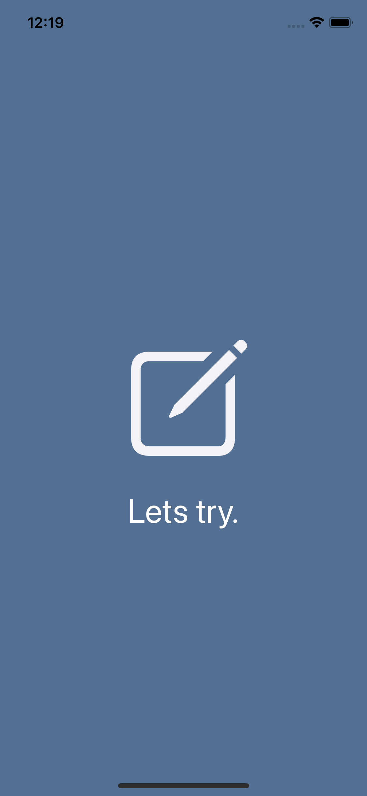
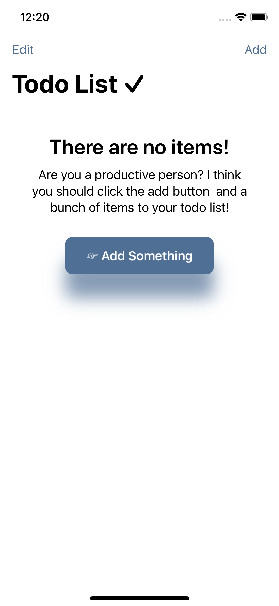
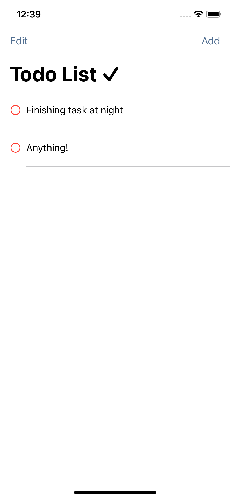
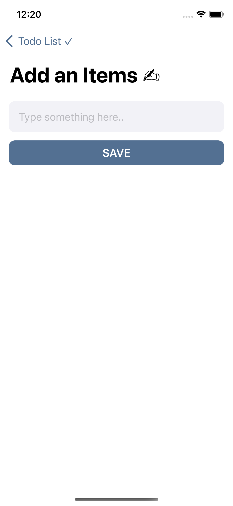
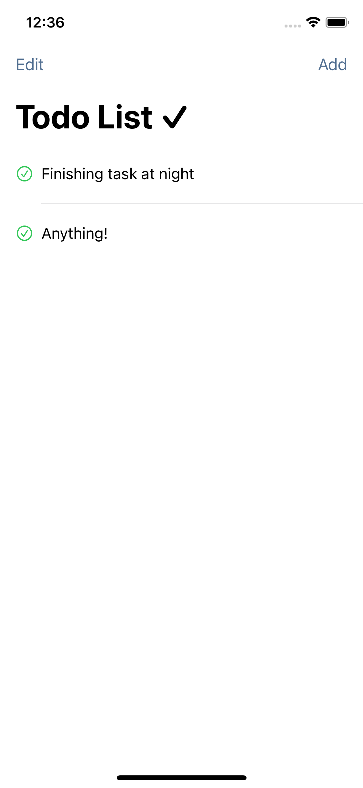
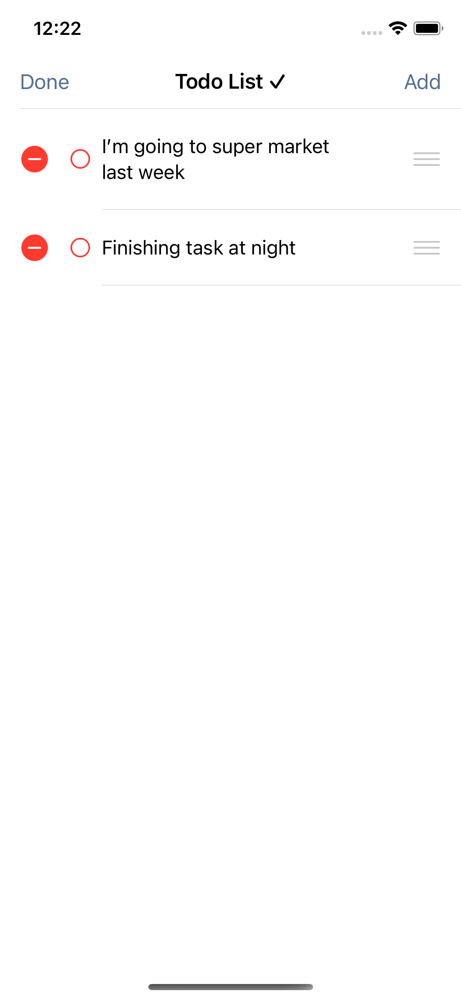

# Todo List App

Aplikasi Todo List sederhana untuk iOS yang dibuat menggunakan **SwiftUI** dengan menerapkan pola arsitektur **MVVM (Model-View-ViewModel)**.

Project ini dibuat sebagai bagian dari proses pembelajaran pengembangan aplikasi iOS menggunakan SwiftUI, khususnya untuk memahami pengelolaan data, state, navigasi antar-View, dan penyimpanan data secara lokal menggunakan `UserDefaults`.

---

## 📱 App Preview

### Splash Screen



### Empty State



### Todo List



### Add Todo



### Completed Todo



### Delete Todo



---

## ✨ Features

Beberapa fitur yang tersedia pada aplikasi:

- Menampilkan daftar Todo
- Menambahkan Todo baru
- Menandai Todo sebagai selesai
- Mengubah status Todo
- Menghapus Todo
- Mengatur ulang posisi Todo
- Menyimpan data secara lokal
- Menampilkan empty state ketika belum ada Todo
- Splash screen saat aplikasi dijalankan

---

## 🏗️ Architecture

Project ini menggunakan pola arsitektur **MVVM (Model-View-ViewModel)**.

### Model

Model bertanggung jawab untuk merepresentasikan struktur data yang digunakan oleh aplikasi.

File:

```text
TodoList/
└── Models/
    └── ItemModel.swift
```

`ItemModel` menyimpan informasi setiap Todo, yaitu:

- `id`
- `title`
- `isCompl`

Model juga menggunakan:

```swift
Identifiable
Codable
```

`Identifiable` digunakan agar setiap Todo memiliki identitas yang dapat digunakan oleh SwiftUI.

Sedangkan `Codable` digunakan untuk membantu proses encoding dan decoding data ketika menyimpan data Todo secara lokal.

---

### View

View bertanggung jawab untuk menampilkan antarmuka aplikasi kepada pengguna.

Beberapa View yang digunakan:

```text
TodoList/
└── Views/
    ├── AddView.swift
    ├── ListRowView.swift
    ├── ListView.swift
    ├── NoItemsView.swift
    └── LaunchScreen.storyboard
```

Masing-masing View memiliki tanggung jawab yang berbeda, seperti:

- `ListView` → menampilkan daftar Todo
- `ListRowView` → menampilkan setiap item Todo
- `AddView` → halaman untuk menambahkan Todo
- `NoItemsView` → tampilan ketika belum terdapat Todo
- `LaunchScreen.storyboard` → tampilan awal aplikasi

---

### ViewModel

ViewModel menjadi penghubung antara Model dan View.

File:

```text
TodoList/
└── ViewModels/
    └── ListViewModel.swift
```

`ListViewModel` bertanggung jawab untuk mengelola data Todo, seperti:

- Mengambil data Todo
- Menambahkan Todo
- Menghapus Todo
- Mengubah status Todo
- Mengatur ulang posisi Todo
- Menyimpan data Todo

ViewModel menggunakan:

```swift
ObservableObject
```

dan:

```swift
@Published
```

sehingga perubahan data dapat diteruskan ke View dan membuat tampilan diperbarui secara otomatis.

---

## 💾 Local Data Storage

Aplikasi menggunakan **UserDefaults** untuk menyimpan data Todo secara lokal pada perangkat.

Data Todo terlebih dahulu diubah menjadi bentuk data menggunakan:

```swift
JSONEncoder
```

Kemudian disimpan ke `UserDefaults`.

Ketika aplikasi dijalankan kembali, data akan diambil dari `UserDefaults` dan dikembalikan menjadi object menggunakan:

```swift
JSONDecoder
```

Secara sederhana, alurnya adalah:

```text
ItemModel
    ↓
JSONEncoder
    ↓
UserDefaults
    ↓
JSONDecoder
    ↓
ItemModel
```

Dengan pendekatan ini, data Todo dapat tetap tersedia setelah aplikasi ditutup dan dijalankan kembali.

---

## 📂 Project Structure

```text
TodoList/
│
├── Assets.xcassets
│
├── Models/
│   └── ItemModel.swift
│
├── ViewModels/
│   └── ListViewModel.swift
│
├── Views/
│   ├── AddView.swift
│   ├── ListRowView.swift
│   ├── ListView.swift
│   ├── NoItemsView.swift
│   └── LaunchScreen.storyboard
│
├── ContentView.swift
└── TodoListApp.swift
```

---

## 🛠️ Tech Stack

Teknologi yang digunakan dalam project ini:

- **Swift**
- **SwiftUI**
- **Xcode**
- **MVVM**
- **UserDefaults**
- **JSONEncoder**
- **JSONDecoder**

---

## 📚 Concepts Learned

Melalui project ini, beberapa konsep yang dipelajari antara lain:

### SwiftUI

Memahami cara membangun User Interface menggunakan pendekatan deklaratif dari SwiftUI.

### MVVM

Memahami pembagian tanggung jawab antara:

```text
Model
View
ViewModel
```

sehingga pengelolaan data dan tampilan tidak berada pada satu bagian saja.

### State Management

Menggunakan:

```swift
@Published
```

dan:

```swift
ObservableObject
```

untuk mengelola perubahan data pada aplikasi.

### Navigation

Memahami perpindahan antar halaman atau View dalam aplikasi SwiftUI.

### List Management

Mempelajari bagaimana mengelola data Todo seperti:

- Add
- Delete
- Update
- Move

### Local Storage

Mempelajari cara menyimpan data sederhana secara lokal menggunakan `UserDefaults`.

### JSON Encoding & Decoding

Mempelajari proses mengubah object Swift menjadi data yang dapat disimpan dan mengembalikannya kembali menjadi object Swift.

---

## 🚀 How to Run

### 1. Clone Repository

```bash
git clone https://github.com/mfikrirmdhn/todoListApp.git
```

### 2. Masuk ke Folder Project

```bash
cd todoListApp
```

### 3. Buka Project di Xcode

Buka file:

```text
TodoList.xcodeproj
```

atau jalankan:

```bash
open TodoList.xcodeproj
```

### 4. Pilih Simulator

Pilih perangkat iPhone yang tersedia pada Xcode.

### 5. Jalankan Aplikasi

Tekan:

```text
⌘ + R
```

atau klik tombol **Run** pada Xcode.

---

## 🎯 Project Status

Project ini merupakan **project pembelajaran (learning project)** yang dibuat untuk memahami dasar-dasar pengembangan aplikasi iOS menggunakan SwiftUI.

Fokus utama project ini adalah proses belajar:

- SwiftUI
- MVVM
- State management
- Local data storage
- Navigation
- Pengelolaan data pada aplikasi

Aplikasi ini belum ditujukan sebagai aplikasi production dan masih dapat dikembangkan lebih lanjut.

---

## 🔮 Future Improvements

Beberapa pengembangan yang dapat dilakukan selanjutnya:

- Menambahkan fitur edit Todo
- Menambahkan kategori Todo
- Menambahkan deadline atau reminder
- Menambahkan fitur pencarian
- Menambahkan filter Todo
- Menggunakan database seperti SwiftData atau Core Data
- Menambahkan unit testing
- Memperbaiki desain dan pengalaman pengguna

---

## 👨‍💻 Author

**Muhammad Fikri Romadhon**

GitHub: [@mfikrirmdhn](https://github.com/mfikrirmdhn)

---

## 📌 Note

Project ini dibuat sebagai bagian dari proses belajar dan eksplorasi pengembangan aplikasi iOS menggunakan SwiftUI.

Feedback dan saran untuk pengembangan project sangat terbuka.
